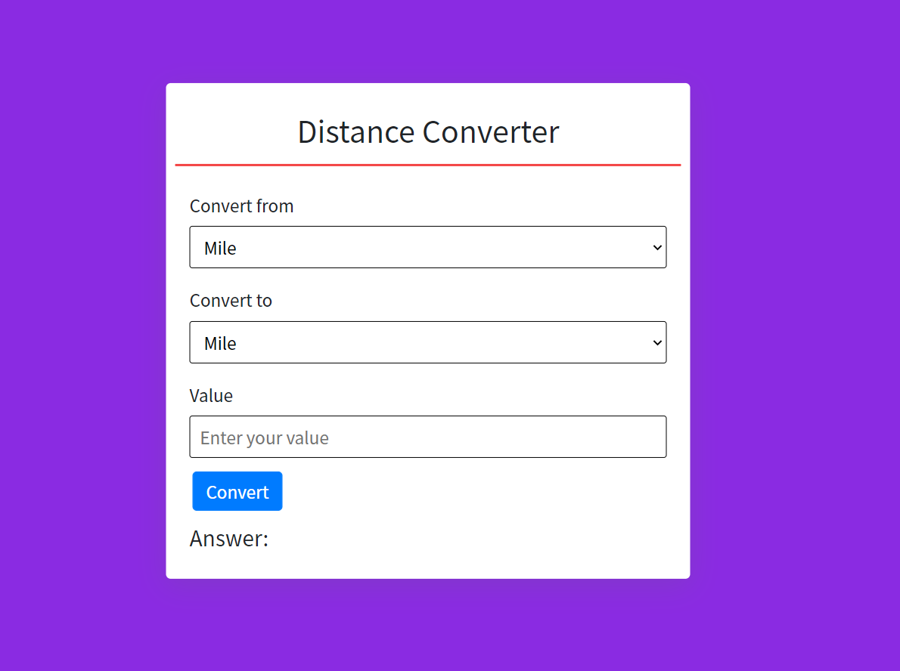

# Distance Converter in JavaScript

## Image:

## Try now:
Watch now [Click here](https://varshil-shah.github.io/distance-converter.github.io/)

## Objective:
To convert distance from one unit to another.

## Use case:
1. Useful for engineering measurements.

## About the creator:
### Varshil Shah
Feel free to mail me at my email address [Varshil Shah](mailto:varshilshah1004+github@gmail.com "Varshil Shah") for any queries.

>Work hard + Smart

